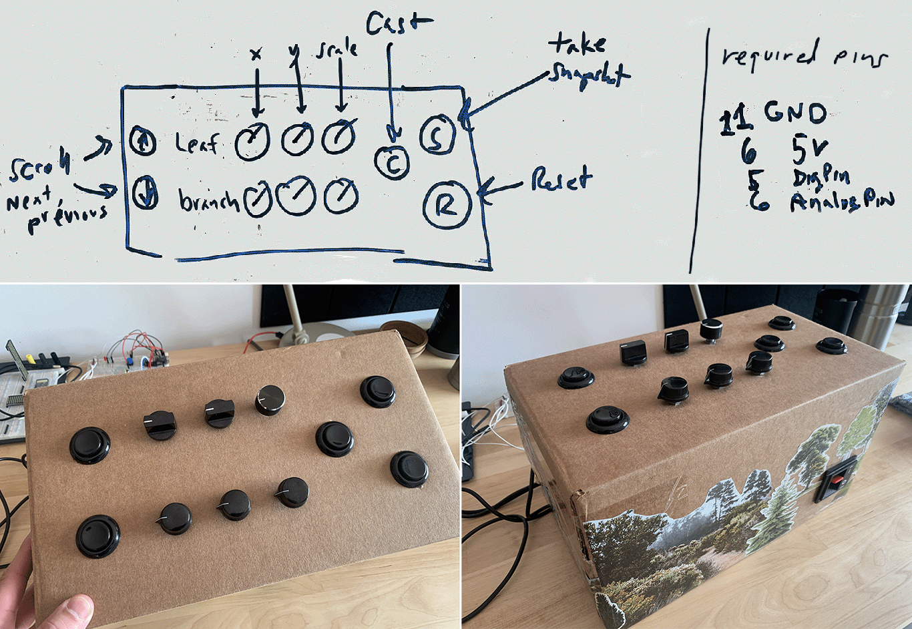
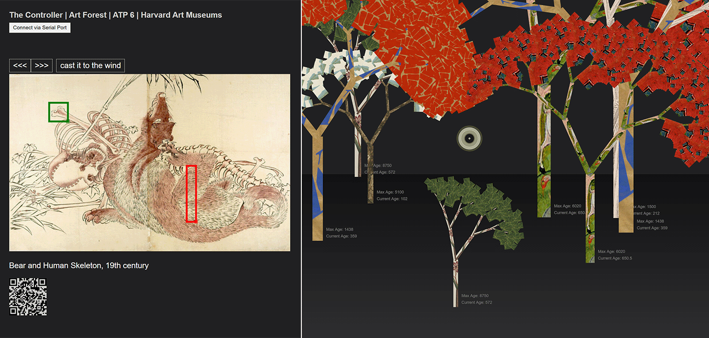

# Art Forest | ATP-6

Another scrappy demo project by HAM DIET. This is another interation of the Art Forest project. This version was created for [ArtTechPsyche](https://arttechpsyche.org/) on March 24, 2023.

## About

The `controller` folder contains code for a custom controller built on an Arduino. 

[Edit the diagram on Tinkercad](https://www.tinkercad.com/things/apwWpyJJ8s8?sharecode=rr6WXzOZs2JMFjJ2ONxHQaXK1VtDjIYqnlVVWrt_Cng)

Parts list:
* 6 - [10 kΩ Potentiometer](https://www.adafruit.com/product/3391)
* 5 - [Momentary Pushbutton](https://www.adafruit.com/product/1505)
* 1 - [Arduino or clone](https://www.adafruit.com/product/3677)

This is the button layout used for ATP-6.  

The `interface` folder contains code for web interface. This interface connects with the Arduino-based controller using the [Web Serial API](https://developer.mozilla.org/en-US/docs/Web/API/Web_Serial_API).

## Setup

* Clone this repo
* Open a terminal and run `cd interface && npm install`
* Get a [HAM API](http://hvrd.art/api) key
* Copy interface\.env-template to interface\.env
* Open interface\.env in a text editor and set `HAM_APIKEY` to your new HAM API key

## Running the App

* Open a terminal and run `cd interface && npm start`
* Open a browser window to http://localhost:3000
* Open a second browser window to http://localhost:3000/forest

## References

https://whatwebcando.today/serial.html
